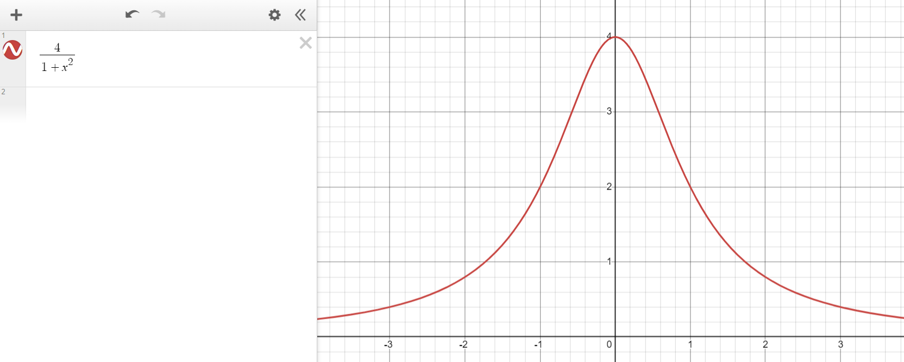
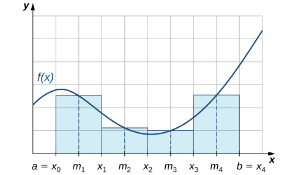

# Multi-Threading or Parallelism

author: [Andrew Gyakobo](https://github.com/Gyakobo)

This project was made to showcase a sample example of muli-threading in the C programming language. To be more exact, in this project we'll be trying to approximate the value $\pi$. 

## Methodology

We'll be utilizing the function $\dfrac{4}{1 + x^2}$, the integral of which is a near approximation of $\pi$. Thus we'll be calculating the following formula:

$$
\int \dfrac{4}{1 + x^2} \, dx \approx \pi
$$

>[!NOTE]
>The graph below showcases the calculated function 

There is of course a minor issue with this calculation. In particular, as the $dx$ component gets ever smaller, the integration gets more precise. Hence it becomes a priority to make the $dx$ as small as possible. This however certainly backfires as with the decreasing $dx$ the integration becomes more complex as there are more facets in the function to compute. 

Here is a more specific example of the aforementioned computation, this isn't a representation of the previously calculated function but still comminucates the same idea: 

As

## License
MIT